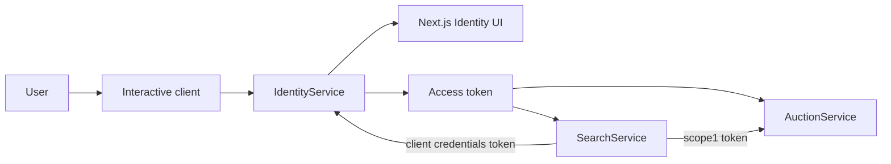
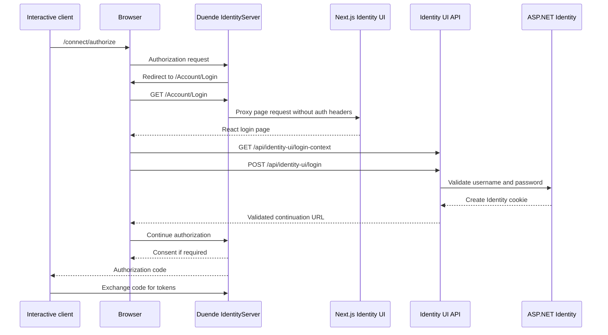
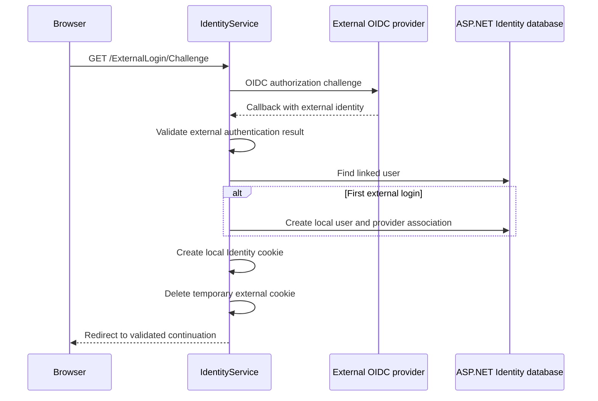
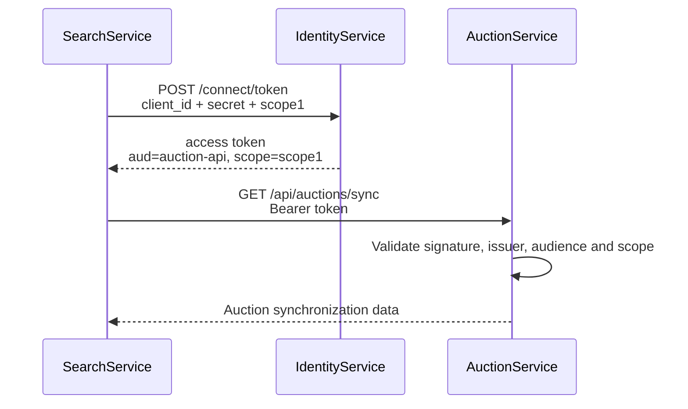

# Revora Authentication and Authorization Guide

This guide explains Revora authentication from the perspective of a junior
engineer. It focuses on the code that exists in this repository and explains
what happens from login through API authorization.

## 1. The Short Mental Model

Revora has three different security jobs:

1. **IdentityService authenticates people and applications.**
2. **IdentityService issues access tokens.**
3. **AuctionService and SearchService validate tokens and decide what a caller
   may do.**

The Next.js Identity UI only displays authentication pages. It does not validate
passwords, issue tokens, or store access tokens.



## 2. Authentication Versus Authorization

These words are related but have different meanings.

### Authentication

Authentication answers:

> Who is making this request?

Examples:

- Validating a username and password.
- Reading the current Identity cookie.
- Validating an API access token.
- Authenticating SearchService with a client ID and secret.

### Authorization

Authorization answers:

> Is this authenticated caller allowed to perform this action?

Examples:

- Does the token contain `scope2`?
- Is this user the seller who owns the auction?
- Is this SearchService token allowed to call the synchronization endpoint?

A caller can be authenticated but still not authorized.

## 3. Main Components

| Component | Security responsibility |
|---|---|
| ASP.NET Identity | Users, passwords, lockout, roles, claims and login cookies |
| Duende IdentityServer | OAuth/OIDC clients, scopes, consent, protocol validation and token issuance |
| Next.js Identity UI | Login, registration, consent and logout screens |
| Identity UI endpoints | Connect React forms to ASP.NET Identity and Duende |
| AuctionService | Validate access tokens, scopes and auction ownership |
| SearchService | Validate tokens and obtain a machine token for synchronization |
| `Contracts` project | Shared audiences, scope values and policy names |

## 4. Important Security Objects

### User

A user is a person stored by ASP.NET Identity in the Identity PostgreSQL
database.

The user has:

- A stable ID.
- A username.
- An email.
- A password hash.
- Claims.
- Lockout information.
- External-login associations.

Passwords are never stored as plain text.

### Client

A client is software that asks IdentityServer for tokens.

Revora currently defines:

| Client | Flow | Purpose |
|---|---|---|
| `m2m.client` | Client Credentials | SearchService-to-AuctionService communication |
| `interactive` | Authorization Code | An application acting for a signed-in user |

The Next.js Identity UI is not one of these clients. It is IdentityServer's
login and consent interface.

### Claim

A claim is a fact about a caller.

Common claims include:

| Claim | Meaning |
|---|---|
| `sub` | Stable user identifier |
| `name` | User-facing display name |
| `preferred_username` | Account username |
| `client_id` | Client that requested the token |
| `scope` | Permissions granted to the token |
| `aud` | API for which the token is intended |
| `iss` | IdentityServer that issued the token |
| `exp` | Token expiration time |

### Scope

A scope represents a permission requested by a client.

Revora retains its original scope values for compatibility:

| Scope | Meaning in Revora |
|---|---|
| `scope1` | Internal SearchService synchronization |
| `scope2` | User-facing API operations |

The shared meanings live in `src/Contracts/RevoraAuth.cs`, so services do not
repeat important security strings.

### Audience

The audience says which API should accept an access token.

Revora defines:

| Audience | API |
|---|---|
| `auction-api` | AuctionService |
| `search-api` | SearchService |

AuctionService rejects a token that was issued only for another audience.

### Policy

An ASP.NET authorization policy combines requirements into a reusable name.

Revora defines:

| Policy | Requirement |
|---|---|
| `auction.write` | Authenticated token with `scope2` |
| `auction.sync` | Authenticated token with `scope1` |
| `search.read` | Authenticated token with `scope2` |

## 5. Cookie Authentication and Token Authentication

Revora uses both cookies and access tokens. They solve different problems.

### Identity cookie

The Identity cookie represents a browser session with IdentityService.

It is used for:

- Login state.
- Consent.
- Logout.
- Grants.
- Diagnostics.
- Device and CIBA interactions.

The cookie is:

- HTTP-only.
- `SameSite=Lax`.
- Secure outside development.
- Consumed only by ASP.NET.

YARP removes the cookie before forwarding a page request to Next.js. Therefore,
Node never sees the Identity cookie.

### Access token

An access token authorizes a client to call an API.

It is sent as:

```http
Authorization: Bearer <access-token>
```

AuctionService and SearchService validate:

- The signing key.
- The issuer.
- The audience.
- The expiration.
- Required scopes.

An ID token must not be used to call an API. ID tokens describe a login to a
client; access tokens authorize API calls.

## 6. Browser Login Flow

The Authorization Code flow is used when a human user is involved.



Important rules:

- React never validates the password.
- React never creates the authentication cookie.
- Duende validates the client and redirect URI.
- The server validates every `returnUrl`.
- Browser mutations require an antiforgery token.
- The client exchanges the authorization code for tokens.

## 7. Why Next.js Does Not Change OAuth

A Razor implementation normally submits forms to a Razor `PageModel`.

Revora submits React forms to ASP.NET endpoints:

| Razor approach | Revora approach |
|---|---|
| `.cshtml` page | React component |
| `OnGet` | Context API endpoint |
| `OnPost` | Mutation API endpoint |
| Bound page property | JSON request contract |
| `ModelState` | `ValidationProblemDetails` |
| Razor redirect | Server-validated navigation response |

ASP.NET Identity, Duende, cookies, access tokens, scopes and resource-server
authorization work the same way. Only the presentation layer is different.

Do not add Auth.js or NextAuth to `IdentityService.Ui`. Doing so would create a
second authentication mechanism where none is needed.

## 8. Custom Profile Service

`RevoraProfileService` controls user claims issued by IdentityServer.

It:

- Loads the user from ASP.NET Identity using the stable `sub`.
- Uses the Identity claims factory.
- Supplies `name` when requested.
- Supplies `preferred_username` when requested.
- Supplies confirmed email when requested.
- Treats missing or locked-out users as inactive.

The profile service does not give every claim to every client. Duende filters
claims according to the requested scopes and resources.

Client Credentials tokens do not represent a user, so they do not contain a
user `sub`, username or seller identity.

## 9. Identity UI Architecture and User Flows

The Identity UI is intentionally split into two layers:

| Layer | Responsibility |
|---|---|
| Next.js pages and React components | Render forms, display errors and request navigation |
| ASP.NET Identity UI endpoints | Validate input, change authentication state and call Duende |

The C# records under `src/IdentityService/IdentityUi/Contracts` define the JSON
request and response shapes. They play the same boundary role that page view
models often play in a Razor application. They are not database entities and
must not contain password hashes, secrets or internal security objects.

Most screens use this pattern:

1. React requests a context endpoint such as `GET /login-context`.
2. ASP.NET builds trusted context using Duende or ASP.NET Identity.
3. The user completes the React form.
4. React obtains an antiforgery token.
5. React submits to a mutation endpoint such as `POST /login`.
6. ASP.NET validates the request and performs the security operation.
7. ASP.NET returns either validation errors or a validated navigation result.
8. The browser performs a top-level navigation.

All identity context responses use `Cache-Control: no-store`.

### Registration

The registration page collects username, email, password and password
confirmation.

The backend:

1. Validates the `returnUrl`.
2. Reads the configured ASP.NET Identity password rules.
3. Validates required fields, email format and matching passwords.
4. Calls `UserManager.CreateAsync`.
5. Enforces unique email and password rules through ASP.NET Identity.
6. Creates a non-persistent Identity cookie by signing in the new user.
7. Continues the original authorization request when one exists.

Registration currently does not send an email-confirmation message. That is a
future feature, so a junior engineer must not assume a registered email has
been verified.

### Local username and password login

The login endpoint calls `PasswordSignInAsync` with lockout-on-failure enabled.
The remember-me choice controls whether the Identity cookie persists beyond
the current browser session.

The endpoint intentionally returns the same invalid-credentials message for a
wrong username, wrong password or locked account. This avoids revealing which
accounts exist.

If the user cancels a Duende authorization request, the backend denies that
request instead of treating the submitted `returnUrl` as an ordinary redirect.

### External login

The login context can expose configured external providers. Revora currently
configures the Duende demo OIDC provider for local development.



External challenge and callback routes remain ASP.NET navigation endpoints.
They cannot be replaced by client-side React code because the authentication
middleware must create and clean up the temporary cookies.

The demo provider and its demo credentials are not a production identity
provider. Production must configure a trusted provider and secrets outside the
repository.

### Consent

Consent happens after login when a client requests identity or API scopes that
need user approval.

Duende supplies the trusted client and resource context. The UI displays it,
but the backend validates the submitted scope names again. Required scopes
cannot be removed. The user can:

- Allow the request.
- Deny the request.
- Select optional scopes.
- Add a consent description.
- Remember consent when the client allows it.

The backend records the decision through Duende and then continues the
authorization flow.

### Logout

Logout removes the local Identity cookie. It can also continue logout at an
upstream external identity provider.

The mutation uses a real top-level form POST with an antiforgery token. This is
important because federated sign-out can return an authentication
`SignOutResult`, not only JSON.

The logged-out page can receive from Duende:

- The client display name.
- A validated post-logout redirect.
- A sign-out iframe URL for coordinated client logout.

The browser must not invent these destinations.

### Device Authorization flow

Device flow is useful for a device with limited input, such as a TV or console:

1. The device obtains a user code from IdentityServer.
2. The user opens `/Device` on another browser.
3. The user signs in and enters the code.
4. Duende resolves the code to the requesting client and scopes.
5. The user approves or denies the request.
6. The device continues polling IdentityServer for the result.

An invalid user code is shown as invalid. The browser never decides which
client owns the code.

### CIBA backchannel login

CIBA lets a client start an authentication request without redirecting the
user's browser from that client.

Revora exposes:

- `/Ciba` to inspect a request and binding message.
- `/Ciba/All` to list the signed-in user's pending requests.
- `/Ciba/Consent` to approve or deny one request.

The binding message helps the user match the browser approval with the action
started on another device. The backend verifies that the pending request
belongs to the current user's `sub`; a request belonging to another user is
returned as not found.

### Grants, diagnostics and server-side sessions

| Page | Purpose | Protection |
|---|---|---|
| `/Grants` | View clients previously granted consent and revoke a grant | Signed-in user |
| `/Diagnostics` | Inspect current cookie claims and authentication properties | Signed-in user and local request only |
| `/ServerSideSessions` | Query and remove server-side sessions when enabled | Signed-in user and local request only |

Revoking a grant removes remembered consent for that client. It does not delete
the user or change the user's password.

Diagnostics and session-management routes deliberately return not-found for
remote requests. Session management also shows an unavailable state when the
Duende server-side-session feature is not configured.

## 10. Client Credentials Flow

Client Credentials is used when software acts as itself and no user is present.

SearchService uses this flow for its startup synchronization.



SearchService caches the token and refreshes it before expiration. It does not
request a new token for every HTTP request.

The client secret must be stored in user-secrets, environment variables or a
production secret manager. It must not be committed to Git.

## 11. Resource-Server Validation

AuctionService and SearchService use JWT bearer authentication.

When an API receives a bearer token:

1. The authentication middleware reads the `Authorization` header.
2. It downloads signing metadata from IdentityService when necessary.
3. It verifies the token signature.
4. It verifies `iss`.
5. It verifies `aud`.
6. It verifies that the token is not expired.
7. ASP.NET creates a `ClaimsPrincipal`.
8. The authorization policy checks the scope.
9. The controller runs only when the policy succeeds.

`UseAuthentication()` must appear before `UseAuthorization()`.

## 12. Current Endpoint Rules

### AuctionService

| Method | Route | Rule |
|---|---|---|
| `GET` | `/api/auctions` | Public |
| `GET` | `/api/auctions/{id}` | Public |
| `GET` | `/api/auctions/sync` | `scope1` |
| `POST` | `/api/auctions` | `scope2` |
| `PUT` | `/api/auctions/{id}` | `scope2` and seller ownership |
| `DELETE` | `/api/auctions/{id}` | `scope2` and seller ownership |

### SearchService

`GET /api/search` is currently intentionally public. SearchService is prepared
to validate user access tokens, and the `search.read` policy is available if
authenticated search becomes a product requirement.

### Identity UI APIs

Identity UI endpoints use the Identity cookie rather than API bearer tokens.
Protected operations include consent, grants, device flow, CIBA, diagnostics
and sessions.

## 13. Auction Ownership

Authentication and scope authorization are not enough for update and delete.

For example, Alice and Bob may both have valid `scope2` tokens, but Alice must
not update Bob's auction.

New auctions store:

- `Seller`: display value.
- `SellerId`: stable `sub` claim used for authorization.

Update and delete compare the current token's `sub` with `SellerId`.

Existing seeded auctions were created before `SellerId` existed. They use a
temporary compatibility rule:

1. Compare the token's `preferred_username` with the old `Seller` value.
2. If it matches during an update, store the stable `sub` in `SellerId`.
3. Use `SellerId` for future authorization.

The `AddSellerIdentity` EF Core migration adds the nullable column without
breaking existing rows.

## 14. Antiforgery Versus Bearer Tokens

Cookie-authenticated browser requests need antiforgery protection because a
browser automatically attaches cookies.

The Identity UI uses:

```http
X-CSRF-TOKEN: <request-token>
```

Bearer API calls normally do not require antiforgery validation because the
browser does not automatically attach the `Authorization` header. The client or
BFF must deliberately add the access token.

Do not disable antiforgery on Identity UI mutations just because the resource
APIs use bearer tokens.

## 15. Understanding 401 and 403

### `401 Unauthorized`

Despite the name, `401` normally means authentication failed.

Common causes:

- No bearer token.
- Expired token.
- Invalid signature.
- Wrong issuer.
- Wrong audience.
- IdentityService metadata is unavailable.

### `403 Forbidden`

`403` means authentication succeeded, but authorization failed.

Common causes:

- Token does not contain the required scope.
- A machine token attempted a user action.
- The user does not own the auction.
- The user lacks a required role or policy.

Simple memory rule:

> `401`: I do not trust who you are.  
> `403`: I know who you are, but you cannot do this.

## 16. Local Configuration

Configure secrets from the repository root:

```powershell
dotnet user-secrets set "IdentityClients:Machine:ClientSecret" "<machine-secret>" --project src\IdentityService\IdentityService.csproj
dotnet user-secrets set "IdentityClients:Interactive:ClientSecret" "<interactive-secret>" --project src\IdentityService\IdentityService.csproj
dotnet user-secrets set "IdentityService:ClientSecret" "<machine-secret>" --project src\SearchService\SearchService.csproj
```

The machine secret must have the same value in IdentityService and
SearchService.

IdentityService refuses to start when its configured client secrets are
missing. SearchService also validates its client-credentials configuration at
startup.

Production must use HTTPS and a real secret manager. Development allows HTTP
metadata only because the services run on localhost.

## 17. Running the Services

Start infrastructure:

```powershell
docker compose up -d
```

Start the private Identity UI:

```powershell
cd src\IdentityService.Ui
npm install
npm run dev
```

Start IdentityService from another terminal:

```powershell
dotnet run --project src\IdentityService\IdentityService.csproj
```

Start the resource services:

```powershell
dotnet run --project src\AuctionService\AuctionService.csproj
dotnet run --project src\SearchService\SearchService.csproj
```

Use the Identity UI through:

```text
http://localhost:5001
```

Do not browse the private Node address to authenticate.

## 18. Testing Client Credentials

Use a development secret that matches the configured user-secret:

```powershell
$body = @{
    grant_type = "client_credentials"
    client_id = "m2m.client"
    client_secret = "<machine-secret>"
    scope = "scope1"
}

$response = Invoke-RestMethod `
    -Method Post `
    -Uri "http://localhost:5001/connect/token" `
    -ContentType "application/x-www-form-urlencoded" `
    -Body $body

$token = $response.access_token
```

Call the protected synchronization endpoint:

```powershell
Invoke-RestMethod `
    -Uri "http://localhost:7001/api/auctions/sync" `
    -Headers @{ Authorization = "Bearer $token" }
```

Expected results:

| Request | Expected result |
|---|---|
| Public auction GET without token | `200` |
| Synchronization GET without token | `401` |
| Synchronization GET with `scope1` token | `200` |
| Auction POST with `scope1` machine token | `403` |

Do not paste production access tokens into public JWT-inspection websites.

## 19. Common Debugging Checklist

### IdentityService does not start

Check:

- Machine client secret is configured.
- Interactive client secret is configured.
- PostgreSQL is available.
- Port `5001` is not occupied.

### SearchService does not start

Check:

- `IdentityService:ClientSecret` is configured.
- Its value matches IdentityService's machine secret.
- IdentityService is running.
- `IdentityService:Authority` is correct.

### API returns 401

Check:

- Header starts with `Bearer`.
- Token is an access token, not an ID token.
- Token is not expired.
- `iss` matches IdentityService.
- `aud` matches the API.
- IdentityService discovery is reachable from the API.

### API returns 403

Check:

- The required `scope` is present.
- A user token is used for user actions.
- `sub` exists for auction creation.
- `SellerId` matches the current user's `sub`.

### Search synchronization fails

Check:

- SearchService requested `scope1`.
- The token contains `aud=auction-api`.
- SearchService calls `/api/auctions/sync`.
- AuctionService can reach IdentityService metadata.

## 20. Security Rules to Preserve

Do:

- Validate issuer, audience, signature and expiration.
- Use the stable `sub` for ownership.
- Keep secrets outside Git.
- Use authorization policies instead of repeated inline checks.
- Return `401` for failed authentication and `403` for failed authorization.
- Cache machine tokens until shortly before expiration.
- Use HTTPS outside local development.

Do not:

- Put access tokens in `localStorage`.
- Send Identity cookies to Next.js.
- Use an ID token to call an API.
- Trust a username or seller ID submitted by the browser.
- Let React decide whether the user owns an auction.
- Put client secrets in a public Next.js bundle.
- Disable audience validation.
- Accept arbitrary redirect URLs.

## 21. Current Boundaries and Future Work

The repository contains the Identity UI but does not yet contain the real
marketplace OIDC client that would request a user access token and call the
resource APIs.

The `interactive` client configuration represents that future or external
client. `IdentityService.Ui` must not take over that responsibility.

Other future identity features include:

- Email confirmation.
- Forgot-password and password-reset flows.
- Multi-factor authentication.
- Account profile management.
- Administrative roles and permissions.
- Production external identity providers.
- Automated authentication integration tests.

## 22. Important Files

| File | Purpose |
|---|---|
| `src/IdentityService/Config.cs` | Identity resources, API resources, scopes and clients |
| `src/IdentityService/HostingExtensions.cs` | IdentityServer, ASP.NET Identity and middleware registration |
| `src/IdentityService/RevoraProfileService.cs` | User claims and active-user checks |
| `src/IdentityService/IdentityUi/IdentityUiEndpoints.cs` | Login, registration, consent and logout behavior |
| `src/Contracts/RevoraAuth.cs` | Shared audience, scope and policy constants |
| `src/AuctionService/Program.cs` | Auction API token validation and policies |
| `src/AuctionService/Controllers/AuctionsController.cs` | Endpoint authorization and ownership |
| `src/SearchService/Program.cs` | Search API token validation and machine-client setup |
| `src/SearchService/Services/ClientCredentialsTokenService.cs` | Machine-token acquisition and caching |
| `src/SearchService/Services/ClientCredentialsTokenHandler.cs` | Adds bearer tokens to AuctionService requests |
| `src/AuctionService/Migrations/*AddSellerIdentity*` | Stable seller ownership database migration |

## 23. Final Summary

Use this sentence as the complete mental model:

> IdentityService proves identity and issues tokens; resource services validate
> those tokens and enforce scopes; AuctionService additionally checks that the
> authenticated user's stable subject ID owns the auction; Next.js only renders
> the Identity experience and never becomes the security authority.

## 24. Further Reading

- [Duende IdentityServer documentation](https://docs.duendesoftware.com/identityserver/)
- [ASP.NET Core JWT bearer authentication](https://learn.microsoft.com/aspnet/core/security/authentication/configure-jwt-bearer-authentication)
- [ASP.NET Core policy-based authorization](https://learn.microsoft.com/aspnet/core/security/authorization/policies)
- [OAuth 2.0 overview](https://oauth.net/2/)
