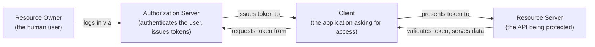
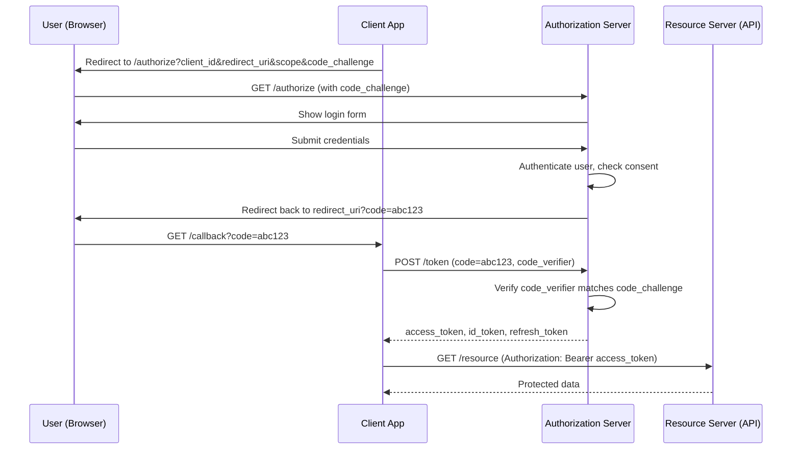
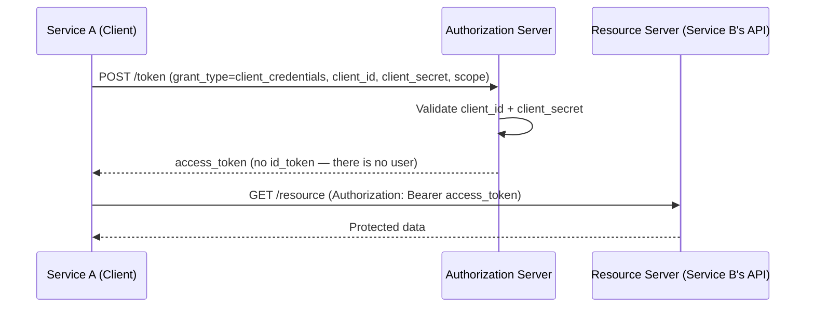
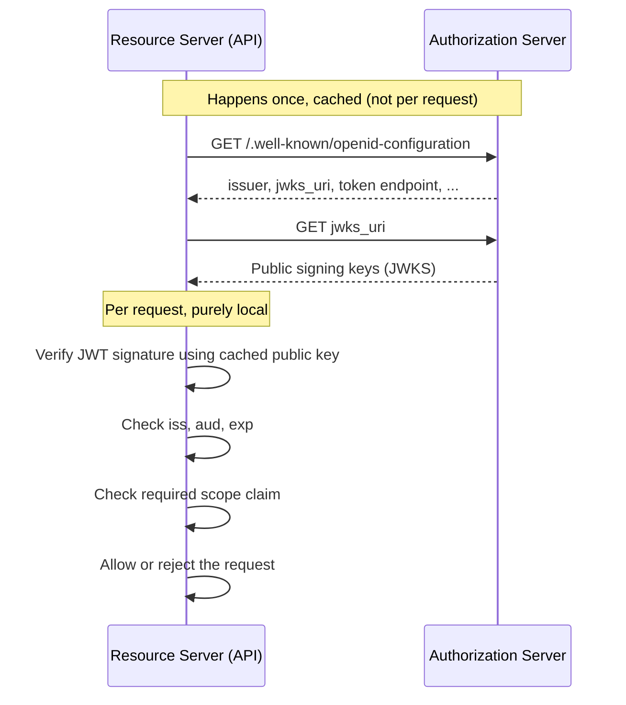
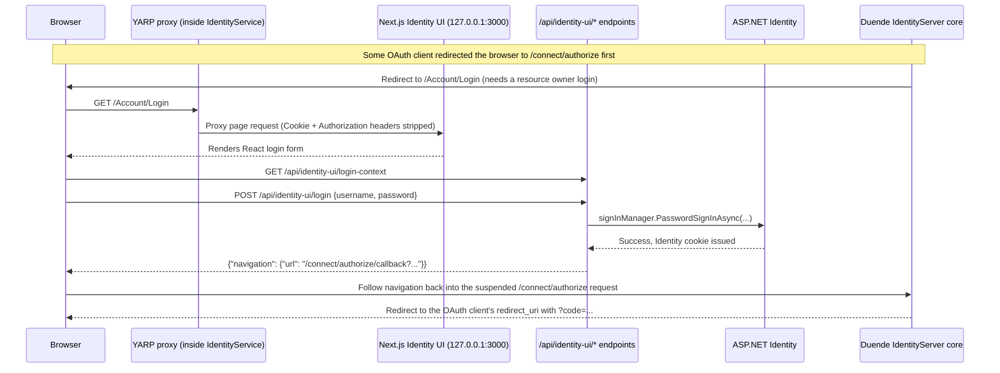
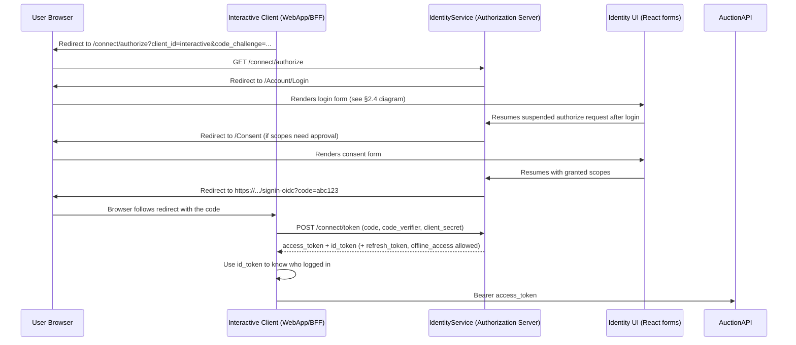
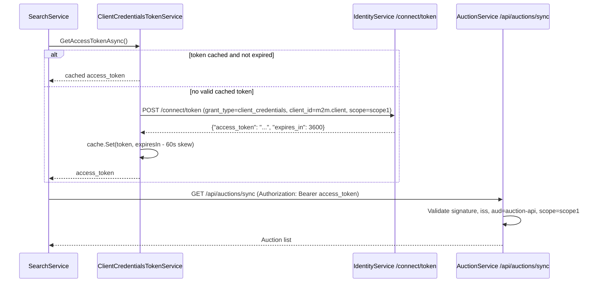

# OAuth 2.0 and OpenID Connect — A Guide for Engineers New to OAuth

This guide assumes you have never worked with OAuth before. Part 1 teaches the
protocol itself, with generic diagrams, independent of Revora. Part 2 takes
every concept from Part 1 and shows exactly where it lives in this codebase,
with diagrams built from the real endpoints, classes and files.

For Revora-specific claim tables, policy tables, and cookie/security rules,
see [`AUTHENTICATION_GUIDE.md`](./AUTHENTICATION_GUIDE.md). This guide focuses
on the *protocol*: why it has the shape it has, and how Revora's code
implements that shape.

---

## Part 1 — OAuth 2.0 from Zero

### 1.1 The problem OAuth solves

Before OAuth, if App A wanted to act on your behalf against App B, App A
needed your App B password. You typed your Google password into some
random calendar app. That app could now do *anything* your Google account
could do, forever, until you changed your password.

OAuth replaces "hand over your password" with "hand over a limited, revocable
token." The app never sees your password. The token can be scoped to specific
permissions and it can expire.

> **OAuth 2.0 is an authorization protocol.** It answers "what is this caller
> allowed to do?" It was not originally designed to answer "who is this
> caller?" — that gap is what OpenID Connect (OIDC) fills. More on this in
> 1.2.

### 1.2 OAuth vs OpenID Connect (OIDC)

This distinction trips up almost every engineer new to the space:

| | Answers | Produces |
|---|---|---|
| **OAuth 2.0** | "What can this app do?" (authorization) | Access token |
| **OpenID Connect** | "Who is this user?" (authentication) | ID token (a JWT describing the login) |

OIDC is a thin identity layer built **on top of** OAuth 2.0. It reuses OAuth's
flows and adds:

- The `openid` scope, which tells the server "also give me identity info."
- The **ID token** — a JWT that says who logged in and when.
- The `/userinfo` endpoint and the `/.well-known/openid-configuration`
  discovery document.

In practice, when people say "OAuth login," they usually mean OIDC running
over OAuth. That is exactly what Revora does — Duende **IdentityServer** is
an OAuth 2.0 authorization server *and* an OIDC provider at the same time.

### 1.3 The four roles

Every OAuth flow has the same four actors, no matter which framework or
language implements them:



| Role | Definition | Plain-English example |
|---|---|---|
| **Resource Owner** | The person who owns the data/account | You |
| **Client** | The application requesting access | A mobile app, SPA, or backend service |
| **Authorization Server** | Authenticates the resource owner and issues tokens | Google Sign-In, Auth0, Duende IdentityServer |
| **Resource Server** | The API that holds the protected resource | Gmail's API, Revora's Auction API |

**Critical rule:** the Client and the Resource Server never exchange
passwords directly. Only the Authorization Server ever sees credentials.

### 1.4 Tokens: access token, refresh token, ID token

| Token | Purpose | Sent to | Typical lifetime |
|---|---|---|---|
| **Access token** | Proves "this caller may call this API with these permissions" | Resource Server, as `Authorization: Bearer <token>` | Minutes to a couple hours |
| **Refresh token** | Lets a client get a new access token without re-authenticating the user | Authorization Server only | Days to months |
| **ID token** | Proves "this user logged in, here is who they are" | The Client itself (never an API) | Same as access token, but single-use per login event |

The single most common junior mistake: **sending the ID token to an API
instead of the access token.** The ID token describes a login event to the
client application; it was never meant to authorize an API call. APIs expect
access tokens.

### 1.5 Access tokens are usually JWTs

A JWT (JSON Web Token) is three base64url segments separated by dots:

```
header.payload.signature
```

Decoded, an access token payload typically looks like:

```json
{
  "sub": "8a29f9c1-...",
  "client_id": "some-client",
  "scope": "openid profile orders.read",
  "aud": "orders-api",
  "iss": "https://auth.example.com",
  "exp": 1730476800,
  "iat": 1730473200
}
```

| Claim | Meaning |
|---|---|
| `sub` | Subject — stable identifier of the user (or, for machine tokens, the client) |
| `client_id` | Which registered client requested this token |
| `scope` | Space-delimited list of permissions granted |
| `aud` | Audience — which API this token is valid for |
| `iss` | Issuer — which Authorization Server signed this token |
| `exp` / `iat` | Expiry / issued-at, as Unix timestamps |

A Resource Server validates a JWT **without calling the Authorization Server
on every request** — it fetches the Authorization Server's public signing
key once (via a JSON Web Key Set, JWKS), caches it, and verifies the
signature locally. This is why OAuth-protected APIs can scale: token
validation is a local cryptographic check, not a network round trip.

### 1.6 Scopes vs claims — a distinction worth getting right

- A **scope** is a *request* for permission (`"I want orders.read"`), sent by
  the client and granted (fully, partially, or not at all) by the
  Authorization Server / resource owner.
- A **claim** is a *fact* embedded in a token (`"sub": "123"`,
  `"email": "a@b.com"`). Some claims come from granted scopes (`profile`
  scope → `name` claim); others (`exp`, `iss`) are structural and always
  present.

Scopes control what goes *into* the token. Claims are what you read back
*out* of the token.

### 1.7 Grant types — how a client actually gets a token

"Grant type" = the recipe a client follows to obtain a token. Four you'll
meet in the wild:

| Grant type | Used when | Involves a browser? | Involves a user? |
|---|---|---|---|
| **Authorization Code (+ PKCE)** | A human is signing into an app | Yes | Yes |
| **Client Credentials** | One backend service calls another, no human involved | No | No |
| **Refresh Token** | Renewing an expired access token | No | No (silent) |
| **Resource Owner Password (ROPC)** | Legacy — client collects the password directly | No | Yes |

ROPC defeats the entire point of OAuth (the client sees the password again)
and is deprecated in the OAuth 2.1 draft. Revora does not use it anywhere;
IdentityService's own React login form is not an OAuth client performing
ROPC — it's the Authorization Server's *own* first-party login page talking
directly to ASP.NET Identity, not to an external client. That distinction
matters and is explained in Part 2.

### 1.8 Authorization Code flow, generically

This is the flow used whenever a human logs into an application through a
browser (or embedded webview). Walk it once, generically, before seeing
Revora's version:



Why the redirect dance instead of the client just asking for a token
directly? Because the **client never sees the user's password.** The
password is typed only into a page served by the Authorization Server. The
client receives, at most, a short-lived one-time code — and even that code
is useless without the PKCE secret described next.

### 1.9 PKCE — why the "code_challenge" step exists

PKCE (Proof Key for Code Exchange, pronounced "pixy") closes a specific
attack: if a malicious app on the same device intercepts the redirect
containing `?code=abc123`, it could try to exchange that code for tokens
itself.

PKCE fixes this by having the *original* client generate a secret before the
flow even starts:

1. Client generates a random `code_verifier` (kept secret, in memory).
2. Client computes `code_challenge = SHA256(code_verifier)` and sends only
   the challenge in the `/authorize` request.
3. When exchanging the code at `/token`, the client must also send the raw
   `code_verifier`.
4. The Authorization Server re-hashes it and checks it matches the
   `code_challenge` from step 2.

An attacker who steals the authorization code still cannot redeem it,
because they never had the `code_verifier`. Modern OAuth requires PKCE for
**every** Authorization Code client, not just public/mobile ones — it's
cheap, and it removes an entire attack class for free.

### 1.10 Client Credentials flow, generically

Used when there is no human — one backend service authenticating to another
as itself:



Notice: one HTTP request, no browser, no redirect, no `code`. `sub` is
usually absent from the resulting token (or equals the client itself) —
there is no resource owner in this flow, only a client acting as itself.

### 1.11 How a Resource Server validates a token without ever talking to the Authorization Server per-request



This is the piece that makes OAuth practical at scale: after the one-time
discovery + key fetch, every subsequent request is validated with pure math,
no network call to the Authorization Server.

---

## Part 2 — How This Maps Onto Revora

### 2.1 Role mapping

| Generic OAuth role | Revora component | File |
|---|---|---|
| Authorization Server | Duende IdentityServer, hosted inside **IdentityService** | `src/IdentityService/HostingExtensions.cs` |
| Resource Owner store | ASP.NET Identity (users, passwords, claims) | `src/IdentityService/Models/ApplicationUser.cs`, `Data/ApplicationDbContext.cs` |
| Login/consent UI | Next.js app, proxied by IdentityService | `src/IdentityService.Ui/` |
| Registered clients | `m2m.client` (Client Credentials), `interactive` (Authorization Code + PKCE, reserved for the planned Next.js WebApp/BFF) | `src/IdentityService/Config.cs` |
| Resource Servers (APIs) | AuctionService, SearchService | `src/AuctionService/Program.cs`, `src/SearchService/Program.cs` |
| Shared scope/audience/policy names | `Contracts` project | `src/Contracts/RevoraAuth.cs` |

Revora runs **one Authorization Server two Resource Servers**, with two
different kinds of clients: a machine client (SearchService, calling
AuctionService as itself) and an interactive client (reserved for a future
first-party web app — see `README.md`'s planned `WebApp/` BFF).

### 2.2 IdentityService is the Authorization Server — where that's configured

```csharp
// src/IdentityService/HostingExtensions.cs
builder.Services
    .AddIdentityServer(options => { /* login/consent/error URLs */ })
    .AddInMemoryIdentityResources(Config.IdentityResources)
    .AddInMemoryApiScopes(Config.ApiScopes)
    .AddInMemoryApiResources(Config.ApiResources)
    .AddInMemoryClients(Config.GetClients(builder.Configuration))
    .AddAspNetIdentity<ApplicationUser>()
    .AddProfileService<RevoraProfileService>();
```

This one call registers:

- The OAuth/OIDC protocol endpoints (`/connect/authorize`, `/connect/token`,
  `/.well-known/openid-configuration`, the JWKS endpoint) — all auto-mapped
  by `app.UseIdentityServer()` in `ConfigurePipeline`.
- The **scopes and resources** clients may request (`Config.ApiScopes`,
  `Config.ApiResources`).
- The **registered clients** (`Config.GetClients`).
- `AddAspNetIdentity<ApplicationUser>()` — wires IdentityServer's login
  process to ASP.NET Identity, so "authenticate the resource owner" (§1.3)
  means "check the password against the `AspNetUsers` table."
- `RevoraProfileService` — decides which extra claims get added to a token
  once IdentityServer knows who the subject is (`src/IdentityService/RevoraProfileService.cs`).

### 2.3 Revora's two OAuth clients

Defined in `src/IdentityService/Config.cs`:

```csharp
// Client Credentials client — SearchService authenticates as itself
new Client
{
    ClientId = "m2m.client",
    AllowedGrantTypes = GrantTypes.ClientCredentials,
    ClientSecrets = { new Secret(machineSecret.Sha256()) },
    AllowedScopes = { RevoraAuth.InternalSyncScope },
}

// Authorization Code + PKCE client — reserved for the future interactive WebApp
new Client
{
    ClientId = "interactive",
    ClientSecrets = { new Secret(interactiveSecret.Sha256()) },
    AllowedGrantTypes = GrantTypes.Code,          // PKCE required by default for this grant type
    RedirectUris = { "https://localhost:44300/signin-oidc" },
    AllowOfflineAccess = true,                     // permits issuing a refresh token
    AllowedScopes = { "openid", "profile", RevoraAuth.UserApiScope },
}
```

This is §1.7's table made concrete: one client uses Client Credentials
(§1.10), the other uses Authorization Code + PKCE (§1.8–1.9).

### 2.4 The part that confuses everyone: IdentityService's own login page is *not* going through an OAuth flow with itself

This is the single biggest source of confusion for engineers new to
IdentityServer-style architectures, so it's worth stating plainly:

**When IdentityServer needs to show a login form, it does not redirect to
some *other* OAuth client's `/authorize` endpoint.** It has its own built-in
login/consent UI role (§1.3's "Authorization Server" also directly owns the
"show the login form" step in the sequence diagram at §1.8). Revora just
happens to implement that login form as a **Next.js app** instead of Razor
pages — but architecturally it is still the Authorization Server's own UI,
not a separate OAuth client.



Key file, walked end to end: `src/IdentityService/IdentityUi/IdentityUiEndpoints.cs`.

- `Login(...)` calls `interaction.GetAuthorizationContextAsync(...)` — this
  re-attaches the login attempt to the OAuth request IdentityServer
  suspended earlier (the one from §1.8, step "AS shows login form").
- On success it calls `signInManager.PasswordSignInAsync(...)` — plain
  ASP.NET Identity password check, no OAuth involved at this step.
- It returns a `NavigationResponse` telling React where to send the browser
  next — which resumes the *suspended* `/connect/authorize` request, letting
  IdentityServer continue the flow from §1.8 (consent, then the redirect
  with `?code=`).
- `SubmitConsent(...)` is the same idea for the consent screen — it's
  the browser's stop at "AS shows login form" in §1.8, generalized to
  "AS shows consent form."

The React app **never touches a password hash, never creates the Identity
cookie itself, and never issues a token.** It only collects form input and
calls these ASP.NET endpoints, which do the actual authentication.

### 2.5 Revora's Authorization Code flow, once a real client is wired to `interactive`

Putting §1.8 and §2.4 together, here is the full flow once a client app
(the planned WebApp/BFF, or any future first-party client using the
`interactive` client) sends a user through login:



### 2.6 Revora's Client Credentials flow — SearchService calling AuctionService

This is §1.10, with real classes:



Files:

- `src/SearchService/Services/ClientCredentialsTokenService.cs` — implements
  the token request + the in-memory cache + the concurrency lock so parallel
  requests don't all fetch a fresh token at once. The `RefreshSkew` of 60
  seconds exists so a token doesn't expire mid-flight to AuctionService.
- `src/SearchService/Services/ClientCredentialsTokenHandler.cs` — a
  `DelegatingHandler` that attaches `Authorization: Bearer <token>` to every
  outgoing HTTP request automatically, so calling code
  (`AuctionSvcHttpClient`) never has to think about tokens at all.
- `src/SearchService/Services/IdentityServiceOptions.cs` — the bound
  configuration (`Authority`, `ClientId`, `ClientSecret`, `Scope`), validated
  at startup with `.ValidateOnStart()` so a missing secret fails fast
  instead of failing on the first real request.

### 2.7 How AuctionService and SearchService validate tokens — §1.11 made concrete

Both APIs configure JWT Bearer authentication the same way:

```csharp
// src/AuctionService/Program.cs (SearchService's Program.cs is identical in shape)
builder.Services
    .AddAuthentication(JwtBearerDefaults.AuthenticationScheme)
    .AddJwtBearer(options =>
    {
        options.Authority = builder.Configuration["IdentityService:Authority"];
        options.Audience = RevoraAuth.AuctionApiAudience;
        options.MapInboundClaims = false;
    });
```

Setting `Authority` is what triggers the entire §1.11 sequence automatically:
the ASP.NET JWT Bearer middleware fetches
`{Authority}/.well-known/openid-configuration`, then the JWKS, caches both,
and from then on validates every incoming token locally — no call back to
IdentityService per request.

Scope-checking is layered on top with ASP.NET's authorization policies,
built from the shared names in `RevoraAuth`:

```csharp
.AddAuthorizationBuilder()
    .AddPolicy(RevoraAuth.AuctionWritePolicy,
        policy => policy.RequireAuthenticatedUser()
            .RequireAssertion(ctx => HasScope(ctx.User, RevoraAuth.UserApiScope)))
```

This is the concrete version of §1.11's last step, "check required scope
claim." `[Authorize(Policy = RevoraAuth.AuctionWritePolicy)]` on a controller
action means: *valid signature, valid issuer/audience, and the `scope` claim
contains `scope2`* — otherwise the request never reaches the action body.

For the full scope/policy/audience tables and the auction-ownership checks
that layer *application* authorization on top of this (e.g. "is this user
the seller who owns this specific auction?"), see sections 4 and 8 of
[`AUTHENTICATION_GUIDE.md`](./AUTHENTICATION_GUIDE.md) — that is
Revora-specific business logic sitting on top of the generic OAuth
validation described here.

### 2.8 Discovery document — try it yourself

IdentityServer auto-publishes the OIDC discovery document Part 1 referenced.
With IdentityService running locally:

```
http://localhost:5001/.well-known/openid-configuration
```

Open it and you'll see `authorization_endpoint`, `token_endpoint`,
`jwks_uri`, and `scopes_supported` — the exact values `AddJwtBearer` and any
Authorization Code client fetch automatically. It's also linked from the
Identity UI home page ("DISCOVERY DOCUMENT").

---

## Part 3 — Common Junior-Engineer Traps

| Trap | Why it's wrong | Where to look instead |
|---|---|---|
| Sending the `id_token` to an API | ID tokens describe a login to the client, not authorization for an API call | Use the `access_token`; see §1.4 |
| Assuming the React Identity UI validates passwords | It only calls ASP.NET endpoints; ASP.NET Identity does the check | §2.4, `IdentityUiEndpoints.cs` |
| Thinking every request to AuctionService calls back to IdentityService | Tokens are validated locally via cached JWKS | §1.11 / §2.7 |
| Confusing `scope` (a permission request) with `claim` (a fact in the token) | They interact, but are not the same thing | §1.6 |
| Skipping PKCE for a "public" client because it has a secret | Revora's `interactive` client uses PKCE *and* a secret — belt-and-suspenders, not either/or | §1.9, §2.3 |
| Trying to reuse a `client_credentials` token to act as a user | There is no `sub`/user in that flow — it's the service acting as itself | §1.10, §2.6 |
| Hardcoding scope/audience strings in a new service instead of reusing `RevoraAuth` | Drifting strings silently break policy checks | `src/Contracts/RevoraAuth.cs` |
