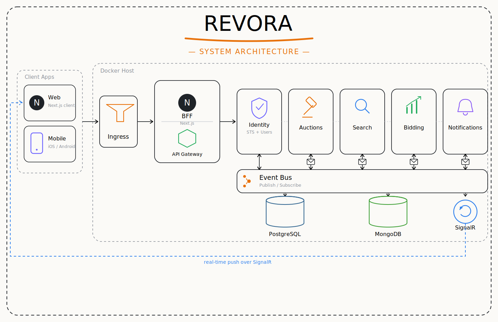
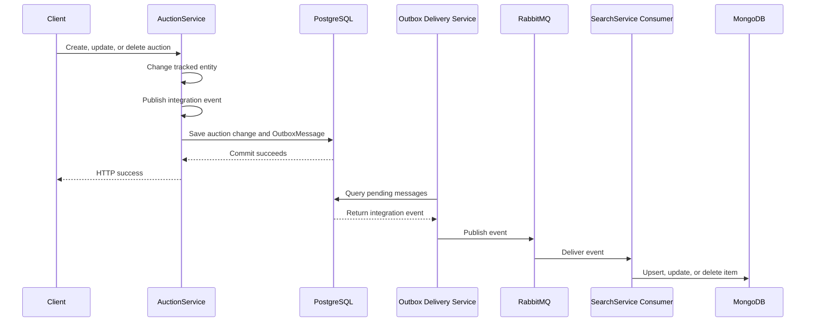

<div align="center">

# Revora

### Event-Driven Vehicle Auction Backend


</div>

---

## About

Revora is an in-progress vehicle auction platform built to demonstrate a practical .NET microservices architecture. The current repository contains two backend services:

- **AuctionService** owns auction data in PostgreSQL and exposes auction CRUD endpoints.
- **SearchService** maintains a MongoDB read model optimized for searching, filtering, sorting, and paging auctions.

The services are synchronized asynchronously through RabbitMQ and MassTransit. AuctionService uses a PostgreSQL-backed transactional Bus Outbox so auction changes and outgoing integration events are committed together.

> This README describes the features that are currently implemented in this repository. Identity, bidding, notifications, a gateway, and a web frontend are planned but are not present yet.

## Table of Contents

- [General Architecture](#general-architecture)
- [Implemented Features](#implemented-features)
- [Service Responsibilities](#service-responsibilities)
- [Event-Driven Synchronization](#event-driven-synchronization)
- [Transactional Outbox](#transactional-outbox)
- [API Reference](#api-reference)
- [Search Behavior](#search-behavior)
- [Technology Stack](#technology-stack)
- [Getting Started](#getting-started)
- [Project Structure](#project-structure)
- [Current Limitations](#current-limitations)
- [Roadmap](#roadmap)

## General Architecture

<div align="center">



</div>

The diagram presents Revora's general target architecture: web and mobile clients enter through ingress, a Next.js BFF and API gateway route requests, independently owned services communicate through a publish/subscribe event bus, and SignalR carries real-time notifications back to clients.

The current repository implements the **AuctionService**, **SearchService**, their PostgreSQL and MongoDB persistence, RabbitMQ event integration, and the shared contracts between them. The remaining components in the diagram represent the intended direction of the platform.

### Architecture principles currently demonstrated

- **Database per service:** AuctionService owns PostgreSQL; SearchService owns MongoDB.
- **CQRS-style read model:** PostgreSQL is the auction source of truth, while MongoDB holds a denormalized query model.
- **Event-driven consistency:** create, update, and delete events keep the search index synchronized.
- **Transactional messaging:** the EF Core Bus Outbox prevents inconsistent database/message dual writes.
- **Shared integration contracts:** message types live in the independent `Contracts` project.
- **Thin consumers:** consumers delegate MongoDB work to `ISearchIndexService`.

## Implemented Features

### Auction management

- List all auctions, optionally requesting only auctions updated after an ISO-8601 timestamp.
- Retrieve an auction by its `Guid` identifier.
- Create an auction with vehicle details, reserve price, image URL, and end time.
- Partially update vehicle make, model, year, color, and mileage.
- Delete an auction.
- Apply EF Core migrations automatically when AuctionService starts.
- Seed PostgreSQL with sample auctions when the database is empty.

### Event-driven search synchronization

- Publish `AuctionCreated`, `AuctionUpdated`, and `AuctionDeleted` integration events.
- Consume those events in SearchService using MassTransit.
- Upsert newly created auctions into MongoDB.
- Apply partial auction updates to the MongoDB read model.
- Remove deleted auctions from MongoDB.
- Log successful consumption and warn when an update/delete event targets a missing search item.
- Retry `AuctionCreated` consumption failures on its explicitly configured receive endpoint.

### Search and discovery

- Case-insensitive search across make, model, color, and seller.
- Search by auction status, including status terms containing spaces, underscores, or hyphens.
- Multi-word search where every token must match a searchable field or status.
- Filter by live, ending-soon, or finished auctions.
- Filter by seller or winner.
- Sort by newest or ending soon.
- Default alphabetical ordering by make and model.
- Page results with a configurable page size capped at 100.
- Return results together with total count and page count.
- Create a MongoDB index over make, model, and color at startup.

### Startup recovery synchronization

SearchService does not depend only on live RabbitMQ events. At startup it also calls AuctionService over HTTP:

1. It reads the most recently updated item in MongoDB.
2. It requests auctions updated after that timestamp.
3. It saves returned items into the search database.
4. It retries transient HTTP failures and `404` responses with exponential backoff.

This provides a catch-up path when SearchService was offline while auctions changed.

## Service Responsibilities

| Project | Responsibility | Storage | Default URL |
|---|---|---|---|
| `AuctionService` | Auction CRUD, PostgreSQL ownership, event publication, Bus Outbox | PostgreSQL | `http://localhost:7001` |
| `SearchService` | Search API, MongoDB read model, event consumers, startup synchronization | MongoDB | `http://localhost:7002` |
| `Contracts` | Shared `AuctionCreated`, `AuctionUpdated`, and `AuctionDeleted` contracts | None | Not hosted |

## Event-Driven Synchronization



### Integration events

| Event | Published when | SearchService action |
|---|---|---|
| `AuctionCreated` | An auction is created | Map the event to an `Item` and upsert it |
| `AuctionUpdated` | Vehicle details are updated | Update supplied fields and `UpdatedAt` |
| `AuctionDeleted` | An auction is deleted | Delete the item with the matching auction ID |

MassTransit endpoints use kebab-case names. SearchService applies the `search` prefix, while the AuctionService fault consumer uses the `auction` prefix.

## Transactional Outbox

AuctionService configures MassTransit's Entity Framework transactional Bus Outbox:

```csharp
x.AddEntityFrameworkOutbox<AuctionDbContext>(o =>
{
    o.QueryDelay = TimeSpan.FromSeconds(10);
    o.UsePostgres();
    o.UseBusOutbox();
});
```

The `AuctionDbContext` maps these MassTransit entities:

- `OutboxMessage` stores outgoing messages waiting for delivery.
- `OutboxState` tracks ordered delivery and locking.
- `InboxState` is mapped for inbox/duplicate-detection support, although an EF Consumer Outbox is not currently enabled on SearchService receive endpoints.

The endpoint order is intentionally:

```csharp
await _publishEndpoint.Publish(message);
await _context.SaveChangesAsync();
```

`Publish` adds the event to the scoped outbox. `SaveChangesAsync` then commits both the auction change and the outbox record in one PostgreSQL transaction. The delivery service publishes committed messages to RabbitMQ afterward.

For a deeper explanation with diagrams, see [OUTBOX_GUIDE.md](OUTBOX_GUIDE.md).

## API Reference

### AuctionService

Base URL: `http://localhost:7001`

| Method | Route | Description |
|---|---|---|
| `GET` | `/api/auctions` | List auctions ordered by vehicle make |
| `GET` | `/api/auctions?date={timestamp}` | List auctions updated after an ISO-8601 timestamp |
| `GET` | `/api/auctions/{id}` | Get one auction by `Guid` |
| `POST` | `/api/auctions` | Create an auction and publish `AuctionCreated` |
| `PUT` | `/api/auctions/{id}` | Update vehicle fields and publish `AuctionUpdated` |
| `DELETE` | `/api/auctions/{id}` | Delete an auction and publish `AuctionDeleted` |

#### Create request example

```json
{
  "make": "Porsche",
  "model": "911 Carrera",
  "year": 2024,
  "color": "Black",
  "mileage": 1200,
  "imageUrl": "https://example.com/porsche-911.jpg",
  "reservePrice": 95000,
  "auctionEnd": "2026-08-01T18:00:00Z"
}
```

#### Partial update example

```json
{
  "color": "Silver",
  "mileage": 1500
}
```

### SearchService

Base URL: `http://localhost:7002`

| Method | Route | Description |
|---|---|---|
| `GET` | `/api/search` | Search, filter, sort, and page the MongoDB auction read model |

#### Query parameters

| Parameter | Accepted values | Default | Purpose |
|---|---|---|---|
| `searchTerm` | Free text or auction status | Empty | Search make, model, color, seller, or status |
| `pageNumber` | Integer greater than zero | `1` | Requested result page |
| `pageSize` | `1` to `100` | `4` | Results per page |
| `orderBy` | `New`, `EndingSoon` | Make/model | Sort results |
| `filterBy` | `Finished`, `EndingSoon`, `Live` | No time filter | Filter by auction end time |
| `seller` | Seller name | Empty | Exact seller filter |
| `winner` | Winner name | Empty | Exact winner filter |

Example:

```http
GET http://localhost:7002/api/search?searchTerm=black%20ford&filterBy=Live&orderBy=EndingSoon&pageNumber=1&pageSize=10
```

Response shape:

```json
{
  "results": [],
  "pageCount": 0,
  "totalCount": 0
}
```

## Search Behavior

### Time-based filters

| Filter | Rule |
|---|---|
| `Live` | `AuctionEnd` is later than the current UTC time |
| `EndingSoon` | Auction ends within the next six hours |
| `Finished` | `AuctionEnd` is at or before the current UTC time |

### Sorting

| Sort | Rule |
|---|---|
| Default | Make ascending, then model ascending |
| `New` | Creation date descending |
| `EndingSoon` | Auction end date ascending |

## Technology Stack

| Area | Technology |
|---|---|
| Runtime | .NET 10 / ASP.NET Core Web API |
| Relational persistence | Entity Framework Core 10, Npgsql, PostgreSQL 16 |
| Search persistence | MongoDB, MongoDB.Entities, MongoDB.Driver |
| Messaging | MassTransit 8.5, RabbitMQ |
| Reliable publishing | MassTransit Entity Framework Bus Outbox |
| Object mapping | AutoMapper |
| HTTP resilience | Polly retry policies |
| Local infrastructure | Docker Compose |

## Getting Started

### Prerequisites

- [.NET 10 SDK](https://dotnet.microsoft.com/download)
- [Docker Desktop](https://www.docker.com/products/docker-desktop/) with Docker Compose
- An API client such as Postman, Bruno, curl, or the included `.http` files

### 1. Start infrastructure

From the repository root:

```bash
docker compose up -d
```

This starts:

| Dependency | Host port |
|---|---|
| PostgreSQL | `5432` |
| MongoDB | `27018` |
| RabbitMQ AMQP | `5672` |
| RabbitMQ management UI | `15672` |

The Compose file contains development-only credentials. Replace them with secrets or environment-specific configuration before using this project outside local development.

### 2. Restore and build

```bash
dotnet restore Revora.slnx
dotnet build Revora.slnx --no-restore
```

### 3. Start AuctionService

Start AuctionService first because SearchService performs an HTTP synchronization against it during startup.

```bash
dotnet run --project src/AuctionService/AuctionService.csproj
```

AuctionService listens on `http://localhost:7001`. It automatically applies EF Core migrations and seeds sample auctions if PostgreSQL is empty.

### 4. Start SearchService

In another terminal:

```bash
dotnet run --project src/SearchService/SearchService.csproj
```

SearchService listens on `http://localhost:7002`, initializes MongoDB indexes, and synchronizes changed auctions from AuctionService.

### 5. Verify the APIs

```bash
curl http://localhost:7001/api/auctions
curl "http://localhost:7002/api/search?pageNumber=1&pageSize=4"
```

## Project Structure

```text
Revora/
├── src/
│   ├── AuctionService/
│   │   ├── Consumers/           # AuctionCreated fault consumer
│   │   ├── Controllers/         # Auction CRUD API
│   │   ├── Data/                # EF Core context and seed data
│   │   ├── DTOs/                # API request/response models
│   │   ├── Entities/            # Auction and vehicle entities
│   │   ├── Migrations/          # PostgreSQL and outbox migrations
│   │   └── Program.cs           # Service and Bus Outbox configuration
│   ├── SearchService/
│   │   ├── Consumers/           # Created, updated, and deleted consumers
│   │   ├── Controllers/         # Search API
│   │   ├── Data/                # MongoDB initialization and startup sync
│   │   ├── Entities/            # MongoDB Item read model
│   │   ├── RequestHelpers/      # Search parameters, filters, and sorting
│   │   ├── Services/            # SearchIndexService and HTTP client
│   │   └── Program.cs           # MongoDB, HTTP, and MassTransit wiring
│   └── Contracts/               # Shared integration-event contracts
├── docker-compose.yaml          # PostgreSQL, MongoDB, and RabbitMQ
├── OUTBOX_GUIDE.md              # Detailed outbox explanation
├── Revora.slnx
└── README.md
```

## Current Limitations

- Authentication and authorization are not implemented.
- New auctions currently use a hardcoded seller value.
- Ownership checks for update and delete operations are still TODOs.
- Bidding and auction-closing workflows are not implemented.
- There is no frontend, API gateway, identity service, or notification service in the current repository.
- SearchService is eventually consistent with AuctionService.
- The EF Bus Outbox protects controller publication, but an EF Consumer Outbox/inbox is not yet enabled for consumer duplicate detection.
- Automated tests and production observability are not yet included.
- Local configuration contains development credentials and is not production-ready.

## Roadmap

- [x] Auction CRUD service backed by PostgreSQL
- [x] MongoDB search read model
- [x] RabbitMQ event-driven synchronization
- [x] Transactional EF Core Bus Outbox
- [x] Startup catch-up synchronization
- [x] Search filtering, sorting, and pagination
- [ ] Authentication, user identity, and seller ownership checks
- [ ] Bid placement, bid history, and auction closing
- [ ] Consumer Outbox/inbox and stronger idempotency guarantees
- [ ] API gateway and centralized cross-cutting concerns
- [ ] Real-time notifications
- [ ] Next.js web client
- [ ] Automated unit and integration tests
- [ ] Structured observability, health checks, and production configuration

---

<div align="center">

Built by **Tareq Abu Sharkh**

</div>
