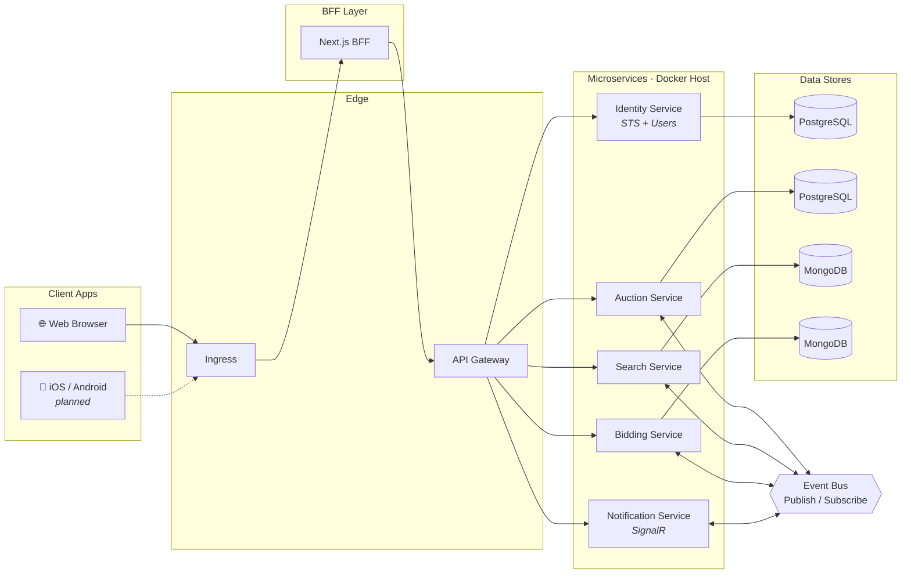

<div align="center">

# 🏎️ Revora
### Real-Time Online Vehicle Auction Platform

      

</div>

---

## 📖 About

**Revora** is a cloud-native, **microservices-based vehicle auction platform** that lets sellers list vehicles and buyers compete for them through **live, real-time bidding**. Every domain — identity, auctions, search, bidding, and notifications — is owned by an independently deployable service. Services communicate asynchronously through an event bus, which keeps the system decoupled, resilient, and easy to scale or extend one capability at a time.

The platform is built around a **Backend-for-Frontend (BFF)** pattern, so each client (web today, mobile tomorrow) gets a tailored API shaped around its needs, while a shared gateway fronts the underlying services.

---

## 📑 Table of Contents

- [Architecture Overview](#-architecture-overview)
- [Core Services](#-core-services)
- [Tech Stack](#-tech-stack)
- [Key Features](#-key-features)
- [Getting Started](#-getting-started)
- [Project Structure](#-project-structure)
- [Roadmap](#-roadmap)
- [Contributing](#-contributing)
- [License](#-license)

---

## 🏗️ Architecture Overview

Revora follows a **distributed, event-driven microservices architecture**, fully containerized and orchestrated behind a single ingress and API gateway.



**Flow at a glance:**
1. Web and mobile clients hit a shared **Ingress**.
2. The **Next.js BFF** composes and tailors API calls per client before forwarding to the **Gateway**.
3. The **Gateway** routes requests to the appropriate downstream microservice.
4. Each service owns its own database — **PostgreSQL** for transactional domains (Identity, Auctions), **MongoDB** for high-read, flexible-schema domains (Search, Bidding).
5. Domain events (new bid placed, auction closed, listing created, etc.) flow through a **Pub/Sub event bus**, keeping services in sync without tight coupling.

---

## 🧩 Core Services

| Service | Responsibility | Database | Notes |
|---|---|---|---|
| **Identity Service** | Authentication, authorization, Security Token Service (STS), user management | PostgreSQL | Issues tokens consumed by every other service |
| **Auction Service** | Vehicle listings, auction lifecycle (create, schedule, close) | PostgreSQL | Source of truth for auction state |
| **Search Service** | Fast, flexible vehicle/auction search & filtering | MongoDB | Denormalized read model, kept in sync via events |
| **Bidding Service** | Real-time bid placement, validation, bid history | MongoDB | High write throughput during live auctions |
| **Notification Service** | Real-time alerts (outbid, auction ending, won/lost) | — | Pushes updates via **SignalR** |

---

## 🛠️ Tech Stack

| Layer | Technology |
|---|---|
| Web Client | Next.js |
| Mobile Client | iOS / Android *(planned)* |
| BFF | Next.js |
| API Gateway / Ingress | Gateway + Ingress controller |
| Backend Services | .NET / C#, Clean Architecture |
| Relational Storage | PostgreSQL |
| Document Storage | MongoDB |
| Real-Time Communication | SignalR |
| Async Messaging | Event Bus (Publish/Subscribe) |
| Containerization | Docker |

---

## ✨ Key Features

- 🔐 **Centralized Identity** — single STS issues and validates tokens across all services
- 🚗 **Vehicle Listings & Auctions** — full lifecycle management from listing to close
- ⚡ **Real-Time Bidding** — instant bid updates pushed to all watchers via SignalR
- 🔎 **Fast Search & Filtering** — MongoDB-backed read model optimized for discovery
- 📡 **Event-Driven Sync** — services stay consistent through domain events, not direct calls
- 🧱 **Independently Deployable Services** — scale or redeploy each domain on its own
- 🖥️ **Per-Client BFF** — APIs shaped specifically for web (and soon, mobile)

---

## 🚀 Getting Started

### Prerequisites
- [Docker](https://www.docker.com/) & Docker Compose
- [.NET 10 SDK](https://dotnet.microsoft.com/) (for local backend development)
- [Node.js 18+](https://nodejs.org/) (for the Next.js BFF/WebApp)

### Run with Docker

```bash
# Clone the repository
git clone https://github.com/<your-username>/revora.git
cd revora

# Spin up all services, databases, and the event bus
docker-compose up --build
```

### Run a service locally

```bash
cd src/Services/Auction
dotnet restore
dotnet run
```

### Run the web client

```bash
cd src/WebApp
npm install
npm run dev
```

> Update environment variables (DB connection strings, event bus host, STS authority URL) in each service's `.env` / `appsettings.Development.json` before running.

---

## 📂 Project Structure

```
revora/
├── src/
│   ├── Gateway/                 # API Gateway
│   ├── WebApp/                  # Next.js BFF + Web client
│   ├── Services/
│   │   ├── Identity/            # STS + Users
│   │   ├── Auction/             # Auction lifecycle
│   │   ├── Search/              # Search & filtering
│   │   ├── Bidding/             # Real-time bidding
│   │   └── Notification/        # SignalR notifications
│   └── BuildingBlocks/          # Shared contracts, event bus abstractions
├── docker-compose.yml
└── README.md
```

---

## 🗺️ Roadmap

- [x] Web client (Next.js)
- [x] Identity, Auction, Search, Bidding, Notification services
- [x] Event-driven communication between services
- [ ] Mobile apps (iOS / Android)
- [ ] Payment & checkout integration
- [ ] Seller/admin dashboard
- [ ] Auction analytics

---

## 🤝 Contributing

Contributions are welcome! Please open an issue to discuss what you'd like to change before submitting a pull request.

1. Fork the repository
2. Create your feature branch (`git checkout -b feature/amazing-feature`)
3. Commit your changes (`git commit -m 'Add amazing feature'`)
4. Push to the branch (`git push origin feature/amazing-feature`)
5. Open a Pull Request

---

## 📄 License

This project is licensed under the MIT License — see the [LICENSE](LICENSE) file for details.

---

<div align="center">

Built by **Tareq** — backend engineer focused on clean, scalable, event-driven architecture.

</div>
