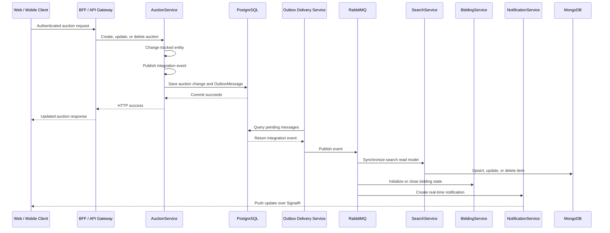

<div align="center">

# Revora

### Real-Time Event-Driven Vehicle Auction Platform


</div>

---

## About

Revora is a production-ready vehicle auction platform where sellers create timed vehicle listings and buyers compete through live bidding. The platform combines a Next.js web experience with independently deployable .NET services for identity, auctions, search, bidding, and notifications.

Client traffic enters through a shared ingress and Backend-for-Frontend layer. Synchronous requests are routed through the API gateway, while RabbitMQ distributes integration events between services. SignalR delivers bid, auction, and notification updates to connected clients in real time.

Each service owns its persistence model. Transactional domains use PostgreSQL, search and bid-history workloads use MongoDB, and MassTransit's transactional outbox keeps database changes and published events consistent.

## Table of Contents

- [General Architecture](#general-architecture)
- [Service Responsibilities](#service-responsibilities)
- [Event-Driven Synchronization](#event-driven-synchronization)
- [Transactional Outbox](#transactional-outbox)
- [API Reference](#api-reference)
- [Search Behavior](#search-behavior)
- [Technology Stack](#technology-stack)
- [Getting Started](#getting-started)
- [Project Structure](#project-structure)

## General Architecture

<div align="center">


</div>

The diagram presents Revora's general architecture: web and mobile clients enter through ingress, a Next.js BFF and API gateway route requests, independently owned services communicate through a publish/subscribe event bus, and SignalR carries real-time notifications back to clients.

### Architecture principles

- **Database per service:** AuctionService owns PostgreSQL; SearchService owns MongoDB.
- **CQRS-style read model:** PostgreSQL is the auction source of truth, while MongoDB holds a denormalized query model.
- **Event-driven consistency:** create, update, and delete events keep the search index synchronized.
- **Transactional messaging:** the EF Core Bus Outbox prevents inconsistent database/message dual writes.
- **Shared integration contracts:** message types live in the independent `Contracts` project.
- **Thin consumers:** message consumers delegate business and persistence work to application services.
- **Real-time delivery:** SignalR pushes bidding and auction state changes to connected clients.
- **Defense in depth:** ingress, gateway policies, token validation, service authorization, retries, and idempotent consumers protect service boundaries.

## Service Responsibilities

| Component | Responsibility | Storage / Integration |
|---|---|---|
| **Next.js Web App and BFF** | Server-rendered auction experience, authenticated sessions, API composition, and client-specific responses | API Gateway, SignalR client |
| **Ingress** | TLS termination, host routing, rate limiting, and public entry-point management | Routes traffic to the BFF and gateway |
| **API Gateway** | Token enforcement, request routing, aggregation, and shared API policies | All backend services |
| **Identity Service** | User registration, login, token issuance, roles, and seller/buyer identity | PostgreSQL, security token service |
| **Auction Service** | Vehicle listings, auction lifecycle, ownership rules, and auction state | PostgreSQL, MassTransit Bus Outbox |
| **Search Service** | Full auction discovery, filtering, sorting, paging, and denormalized read models | MongoDB |
| **Bidding Service** | Bid validation, bid history, current-high-bid state, and winner selection | MongoDB, event bus |
| **Notification Service** | Outbid alerts, auction status updates, winner notifications, and connected-client delivery | SignalR, event bus |
| **Contracts** | Versioned integration events shared between independently deployed services | RabbitMQ message contracts |

## Event-Driven Synchronization



### Integration events

| Event | Published when | Subscribers |
|---|---|---|
| `AuctionCreated` | A seller creates an auction | Search, Bidding, Notifications |
| `AuctionUpdated` | Auction or vehicle details change | Search, Notifications |
| `AuctionDeleted` | A seller or administrator removes an auction | Search, Bidding, Notifications |
| `BidPlaced` | A valid bid becomes the current high bid | Auction, Notifications |
| `AuctionFinished` | The auction end time is reached | Auction, Bidding, Search, Notifications |
| `UserNotificationCreated` | A user-facing event needs delivery | Notification Service / SignalR |

MassTransit endpoints use predictable kebab-case names with service prefixes. Consumers apply retry policies, transactional inbox/outbox handling, and idempotent updates before acknowledging messages.

## Transactional Outbox

AuctionService configures MassTransit's Entity Framework transactional Bus Outbox:

```csharp
x.AddEntityFrameworkOutbox<AuctionDbContext>(o =>
{
    o.QueryDelay = TimeSpan.FromSeconds(10);
    o.UsePostgres();
    o.UseBusOutbox();
});
```

The `AuctionDbContext` maps these MassTransit entities:

- `OutboxMessage` stores outgoing messages waiting for delivery.
- `OutboxState` tracks ordered delivery and locking.
- `InboxState` records consumed message IDs for duplicate detection and idempotent consumer processing.

The endpoint order is intentionally:

```csharp
await _publishEndpoint.Publish(message);
await _context.SaveChangesAsync();
```

`Publish` adds the event to the scoped outbox. `SaveChangesAsync` then commits both the auction change and the outbox record in one PostgreSQL transaction. The delivery service publishes committed messages to RabbitMQ afterward. Message-driven services use the Consumer Outbox so incoming message state, business changes, and outgoing events complete as one reliable unit.

For a deeper explanation with diagrams, see [OUTBOX_GUIDE.md](OUTBOX_GUIDE.md).

## API Reference

All public requests are authenticated and routed through the API Gateway. The BFF uses these routes to compose pages and client-focused responses without exposing internal service topology to browsers or mobile clients.

### Gateway surface

| Method | Route | Owning service | Description |
|---|---|---|---|
| `POST` | `/api/account/register` | Identity | Create a buyer or seller account |
| `POST` | `/api/account/login` | Identity | Authenticate and issue a session/token |
| `GET` | `/api/auctions` | Auction | Browse auction records |
| `POST` | `/api/auctions` | Auction | Create a seller-owned auction |
| `PUT` | `/api/auctions/{id}` | Auction | Update an owned auction |
| `DELETE` | `/api/auctions/{id}` | Auction | Delete an owned auction |
| `GET` | `/api/search` | Search | Search, filter, sort, and page auctions |
| `POST` | `/api/bids` | Bidding | Place a bid on a live auction |
| `GET` | `/api/bids/{auctionId}` | Bidding | Read bid history for an auction |
| `GET` | `/api/notifications` | Notifications | Read the authenticated user's notifications |
| `WS` | `/hubs/notifications` | Notifications | Receive real-time bid and auction updates |

### AuctionService

Internal development URL: `http://localhost:7001`

| Method | Route | Description |
|---|---|---|
| `GET` | `/api/auctions` | List auctions ordered by vehicle make |
| `GET` | `/api/auctions?date={timestamp}` | List auctions updated after an ISO-8601 timestamp |
| `GET` | `/api/auctions/{id}` | Get one auction by `Guid` |
| `POST` | `/api/auctions` | Create an auction and publish `AuctionCreated` |
| `PUT` | `/api/auctions/{id}` | Update vehicle fields and publish `AuctionUpdated` |
| `DELETE` | `/api/auctions/{id}` | Delete an auction and publish `AuctionDeleted` |

#### Create request example

```json
{
  "make": "Porsche",
  "model": "911 Carrera",
  "year": 2024,
  "color": "Black",
  "mileage": 1200,
  "imageUrl": "https://example.com/porsche-911.jpg",
  "reservePrice": 95000,
  "auctionEnd": "2026-08-01T18:00:00Z"
}
```

#### Partial update example

```json
{
  "color": "Silver",
  "mileage": 1500
}
```

### SearchService

Internal development URL: `http://localhost:7002`

| Method | Route | Description |
|---|---|---|
| `GET` | `/api/search` | Search, filter, sort, and page the MongoDB auction read model |

#### Query parameters

| Parameter | Accepted values | Default | Purpose |
|---|---|---|---|
| `searchTerm` | Free text or auction status | Empty | Search make, model, color, seller, or status |
| `pageNumber` | Integer greater than zero | `1` | Requested result page |
| `pageSize` | `1` to `100` | `4` | Results per page |
| `orderBy` | `New`, `EndingSoon` | Make/model | Sort results |
| `filterBy` | `Finished`, `EndingSoon`, `Live` | No time filter | Filter by auction end time |
| `seller` | Seller name | Empty | Exact seller filter |
| `winner` | Winner name | Empty | Exact winner filter |

Example:

```http
GET http://localhost:7002/api/search?searchTerm=black%20ford&filterBy=Live&orderBy=EndingSoon&pageNumber=1&pageSize=10
```

Response shape:

```json
{
  "results": [],
  "pageCount": 0,
  "totalCount": 0
}
```

## Search Behavior

### Time-based filters

| Filter | Rule |
|---|---|
| `Live` | `AuctionEnd` is later than the current UTC time |
| `EndingSoon` | Auction ends within the next six hours |
| `Finished` | `AuctionEnd` is at or before the current UTC time |

### Sorting

| Sort | Rule |
|---|---|
| Default | Make ascending, then model ascending |
| `New` | Creation date descending |
| `EndingSoon` | Auction end date ascending |

## Technology Stack

| Area | Technology |
|---|---|
| Runtime | .NET 10 / ASP.NET Core Web API |
| Web application | Next.js, React, server-side BFF |
| Edge routing | Ingress and API Gateway |
| Identity | Security token service, OAuth 2.0 / OpenID Connect |
| Relational persistence | Entity Framework Core 10, Npgsql, PostgreSQL 16 |
| Document persistence | MongoDB, MongoDB.Entities, MongoDB.Driver |
| Messaging | MassTransit 8.5, RabbitMQ |
| Reliable messaging | MassTransit Bus Outbox and Consumer Outbox |
| Real-time communication | SignalR |
| Object mapping | AutoMapper |
| HTTP resilience | Polly retry policies |
| Infrastructure | Docker, Docker Compose, ingress routing |

## Getting Started

### Prerequisites

- [.NET 10 SDK](https://dotnet.microsoft.com/download)
- [Node.js 20+](https://nodejs.org/)
- [Docker Desktop](https://www.docker.com/products/docker-desktop/) with Docker Compose
- An API client such as Postman, Bruno, or curl for direct API testing

### 1. Configure the environment

Copy the example environment files and provide development values for database connections, RabbitMQ, token signing, gateway routes, and public client URLs.

```bash
cp .env.example .env
```

Secrets should be supplied through environment-specific secret management rather than committed configuration files.

### 2. Start the platform

From the repository root:

```bash
docker compose up --build -d
```

The complete Compose profile starts the application services and their dependencies:

| Component | Local address |
|---|---|
| Web application / BFF | `http://localhost:3000` |
| API Gateway | `http://localhost:6001` |
| Identity Service | `http://localhost:5001` |
| Auction Service | `http://localhost:7001` |
| Search Service | `http://localhost:7002` |
| Bidding Service | `http://localhost:7003` |
| Notification Service | `http://localhost:7004` |
| PostgreSQL | `5432` |
| MongoDB | `27018` |
| RabbitMQ AMQP | `5672` |
| RabbitMQ management UI | `15672` |

### 3. Build services locally

```bash
dotnet restore Revora.slnx
dotnet build Revora.slnx --no-restore
```

Install and build the web application separately when running outside Docker:

```bash
cd src/WebApp
npm install
npm run build
```

### 4. Verify platform health

```bash
docker compose ps
curl http://localhost:6001/health
curl "http://localhost:6001/api/search?pageNumber=1&pageSize=4"
```

Open `http://localhost:3000` to register, sign in, browse auctions, place bids, and observe live updates.

## Project Structure

```text
Revora/
├── src/
│   ├── WebApp/                  # Next.js web client and BFF
│   ├── Gateway/                 # Public API routing and policies
│   ├── IdentityService/         # Users, roles, tokens, and authentication
│   ├── AuctionService/
│   │   ├── Consumers/           # Integration-event consumers
│   │   ├── Controllers/         # Auction CRUD API
│   │   ├── Data/                # EF Core, PostgreSQL, and outbox
│   │   ├── DTOs/                # API request/response models
│   │   ├── Entities/            # Auction and vehicle entities
│   │   ├── Migrations/          # PostgreSQL and outbox migrations
│   │   └── Program.cs           # Service and Bus Outbox configuration
│   ├── SearchService/
│   │   ├── Consumers/           # Created, updated, and deleted consumers
│   │   ├── Controllers/         # Search API
│   │   ├── Data/                # MongoDB initialization and startup sync
│   │   ├── Entities/            # MongoDB Item read model
│   │   ├── RequestHelpers/      # Search parameters, filters, and sorting
│   │   ├── Services/            # SearchIndexService and HTTP client
│   │   └── Program.cs           # MongoDB, HTTP, and MassTransit wiring
│   ├── BiddingService/          # Bid validation, history, and winners
│   ├── NotificationService/     # SignalR hubs and user notifications
│   └── Contracts/               # Shared integration-event contracts
├── docker-compose.yaml          # Full platform and infrastructure
├── docs/
│   └── revora_architecture.svg  # General architecture diagram
├── OUTBOX_GUIDE.md              # Detailed outbox explanation
├── Revora.slnx
└── README.md
```

---

<div align="center">

Built by **Tareq Abu Sharkh**

</div>
