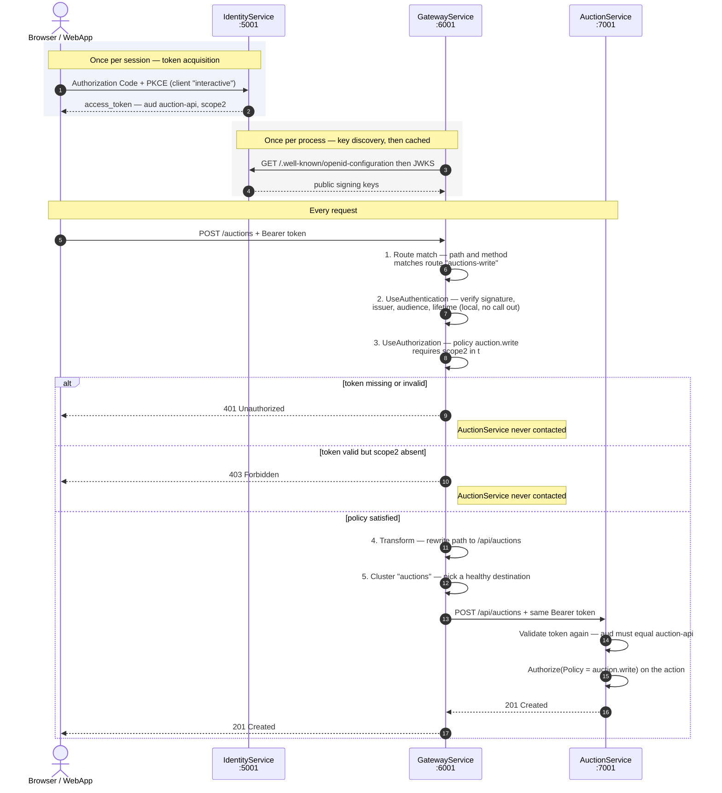

1. Real-world request flow



Two details that matter in production: the JWKS fetch happens once and is cacheds pure local crypto — no round trip to IdentityService. And the gateway forwardsthe Authorization header unchanged, which is what lets AuctionService re-validate independently.

2. Inside the gateway — routing and policy

```mermaid
flowchart TD
A["Request arrives at :6001"] --> B{"YARP route match<br/>path + HTTP method"}

    B -->|"no match"| X404["404 Not Found"]
    B -->|"GET /auctions/sync<br/>literal beats catch-all"| P1["Policy: auction.
    B -->|"GET /auctions/anything"| P2["Policy: anonymous"]
    B -->|"POST PUT DELETE /auctions/anything"| P3["Policy: auction.write"]
    B -->|"GET /search/anything"| P4["Policy: anonymous"]

    P1 --> AUTH
    P3 --> AUTH
    P2 --> TR
    P4 --> TR

    AUTH{"Token present<br/>and valid?"}
    AUTH -->|"no"| X401["401 Unauthorized"]                                                                                                                                                       AUTH -->|"yes"| SCOPE{"Required scope<br/>in scope claim?"}
                                                                                                                                                                                                  SCOPE -->|"auction.sync needs scope1<br/>auction.write needs scope2"| OK["Al
    SCOPE -->|"missing"| X403["403 Forbidden"]
    OK --> TR["Transform<br/>/auctions/x becomes /api/auctions/x"]                                                                                                                                TR --> CL["Cluster resolution<br/>load balance across destinations<br/>skip
    CL --> FW["Forward, stream response back"]
    FW --> S1["AuctionService :7001"]                                                                                                                                                             FW --> S2["SearchService :7002"]
                                                                                                                                                                                              The route table mirrors what AuctionsController actually enforces — GETs are [Altion.write, sync is auction.sync. The edge and the service agree because bothread the same constants from RevoraAuth.
```

3. What the named policy buys you

   ```mermaid flowchart LR
   subgraph DEF["Defined once"] C["RevoraAuth.AuctionWritePolicy<br/>= 'auction.write'<br/><br/>src/Cont
   R["RequireAuthenticatedUser()<br/>+ HasScope(scope2)"] C --- R
   end
    subgraph ENF["Enforced in many places"] E1["Gateway route auctions-write<br/>appsettings.json"]
   E2["POST /api/auctions"] E3["PUT /api/auctions/id"]
   E4["DELETE /api/auctions/id"] end
   DEF ==> E1
   DEF ==> E2 DEF ==> E3
   DEF ==> E4
    N["Rule change — e.g. also require a<br/>verified-seller claim"] -.->|"edit one place"| R
   ```

   Concretely, four benefits:  
   Rejects at the edge. An unauthenticated POST /auctions dies at :6001. AuctionService is never contacted, no DB connection is opened, no outbox row is touched. Under a credential-stuffing burst that difference is the whole point of putting auth at the gateway.
   Precision that [Authorize] can't express. Bare [Authorize] means "any valid toke valid token — it would be allowed to create and delete auctions. The policychecks for scope2, which only the interactive client can request, so machine credentials are structurally locked out of writes. That's the 403 you saw in the earlier test.  
   One definition, many enforcement points. The rule lives in one lambda. Adding a requirement — say, a verified-seller claim — changes one place and instantly applies to the gateway route and all three controller actions. Inline if checks would mean four edits and four ch

Defense in depth without duplication. The gateway and AuctionService register thonstant. Anyone bypassing the gateway and hitting :7001 directly meets anidentical check. The two layers differ only in audience strictness — the gateway accepts either audience since it fronts both services, while each service demands its own exactly.
